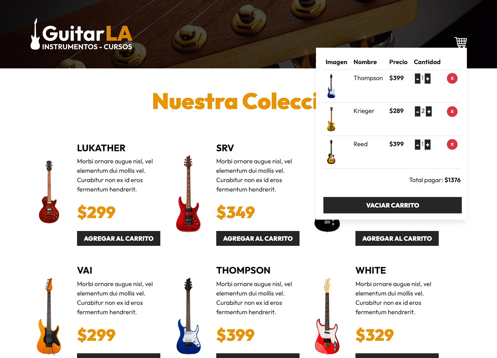

# GuitarLA-TS 🎸​🛒​

Carrito de compras para tienda de guitarras, hecho en ReactJS usando TypeScript.

Tiene las siguientes características:

- Permite agregar/eliminar items al carrito.
- Permite incrementar o decrementar la cantidad de un item en el carrito.
- Permite vaciar carrito.
- Limite mínimo para decremento de items de 1.
- Limite máximo para incremento de items de 5.
- Carrito persistente con localStorage.
- Estilos con Bootstrap compilado.
- NEW: uso del Hook "useReducer" para el estado.

## Run Server 🏃​

Para **desarrollo**: 

1) Instalar dependencias.

```bash
pnpm i
```

2) Correr servidor con:

```bash
pnpm run dev
```
___

Para **producción**: 

1) Repetir pasos No.1 de desarrollo.

2) Generar carpeta "dist" con:

```bash
pnpm run build
```

3) Subir carpeta "dist" al servidor.
    
## Screenshots

